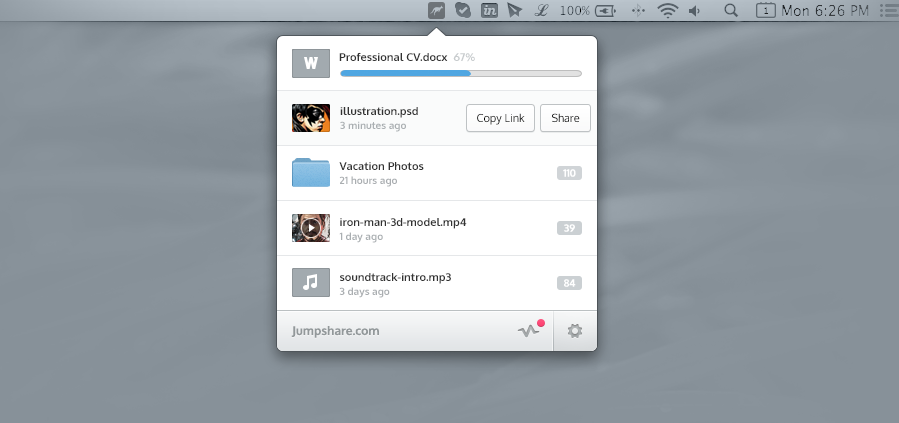

Oxygen Font is a font family originally aimed as a desktop/gui font for integrated use with the KDE desktop. 

The basic concept for Oxygen Font was to design a clear, legible, sans serif, that would be rendered with Freetype on Linux-based devices. In addition a bold weight, plus regular and bold italics, and a monospace version will be made.

<b>Design</b>

Oxygen is constructed closely with the gridfitting aspects of the Freetype font rendering engine. The oxygen fonts are also autohinted with Werner Lemberg's "ttfautohint" library to further the compatibility with the Freetype engine. The aim of this approach is to produce a family of freetype-specific desktop fonts whose appearance will stay uniform under different screen render settings, unlike more traditionally designed 'screen fonts' that have tended to be designed for best legibility on the Windows GDI render engine.

<b>License</b>

The Oxygen Fonts are released under the SIL Open Font License (OFL) version 1.1 and the Gnu General Public License (with font exception) (GPL+FE). 

<b>Testing</b>

'Real world' user testing is vital. If you want to help test the Oxygen Fonts please do so and send feedback to @vernnobile.

<b>BRIEF DESCRIPTION OF BRANCHES, FILES & FOLDERS</b>

Release versions are kept in the MASTER branch

In-progress (not-for-daily-use!) versions are kept in the 'in-progress' branch. Font files in the in-progress branch may be 'broken', have errors etc.

Master branch contains milestone releases, e.g. 0.2, 0.3, 0.4.

'Contributions' - important contributions such as Cyrillic characters.

'Oxygen-GoogleWebFont' - Version of Oxygen for basic webfont use with smaller character sets.

'tools' - extra development files used for metrics, kerning, encoding.
